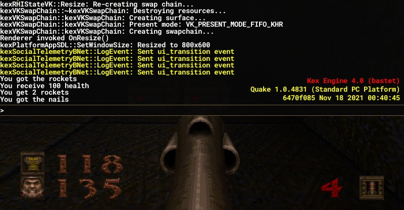

# noclip

Many computer games have a developer console or in-game console which provide a command-line interface for executing commands, changing game variables, or activating cheats. It's a very useful feature seen in many games like Quake (see screenshot below), Skyrim, Minecraft, and Counter-Strike.

`noclip.h` is a single-header library providing a very flexible and easy-to-use backend for building such consoles. By using lambdas and templates, the library elegantly implements a sophisticated backend in very few lines of code (~400 LOC). It also has a dead simple interface.



### Executing Commands
When you want to run a command (e.g. when the user presses enter), call `console.execute(input, output)`. The input contains the command you want to execute. It can be a std::string or any istream such as std::cin.

### Binding Commands
The purpose of console commands is to be able to execute compiled C++ functions from the console. To enable this, you bind C++ functions to the console during the runtime of your program/game.
```c++
void set_cheats(int mode) { ... }
...
console.bind_cmd("sv_cheats", set_cheats);
console.execute("sv_cheats 1", std::cout); // once executed, calls set_cheats with mode 1
```

### Console Variables
You can expose variables of your program to the console by binding them. Once bound, you can set and get their values.
```c++
int hp = 100;
console.bind_cvar("health", &hp);
console.execute("set health 99", std::cout); // once executed, hp becomes 99
```
`set <variable-name> <value>` is a built-in command for mutating console variable values. Execute command `help` to see what other built-in commands there are.

### Creating the Console
```c++
#include "noclip.h"
noclip::console c; // there is no custom constructor
```

More documentation is included directly in the header file.
